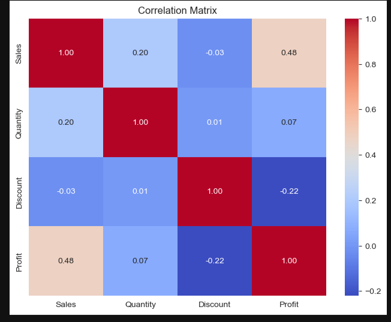
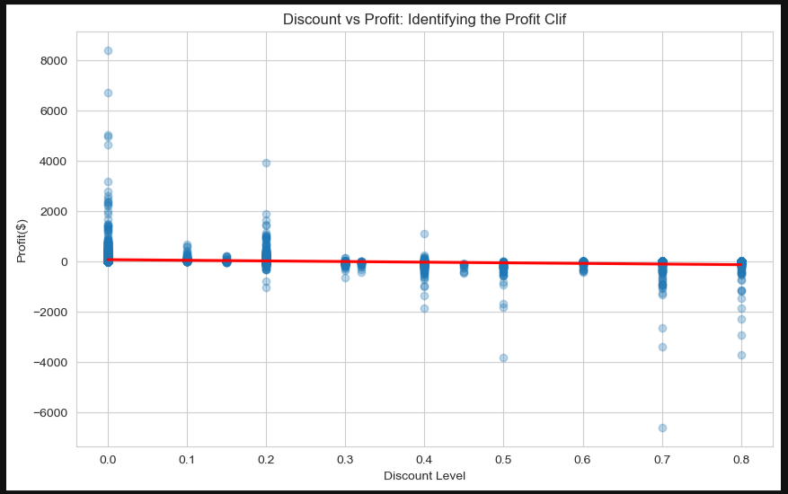

Discount Sensitivity & Profitability Analysis

## 🎯 Project Overview
This project provides a comprehensive data analysis of the **Sample Superstore dataset**. The primary objective was to investigate the relationship between sales, discounts, and profitability. Through statistical correlation and exploratory data analysis (EDA), we uncovered a critical "Profit Cliff"—a threshold where aggressive discounting strategies transition from revenue-driving to profit-eroding.
## 🔑 Key Findings
* **The Profit Cliff:** Profitability remains positive until discounts exceed the 10–20% range, after which profits turn negative.
* **Discount Inefficacy:** There is a near-zero correlation between `Discount` and `Quantity` sold, indicating that customers are not significantly incentivized by the current aggressive discounting strategy.
* **Category Sensitivity:** High-margin categories (like Technology) are disproportionately harmed by excessive discounting compared to other categories.
## 📊 Visual Insights



## 🚀 Business Recommendations
1. **Implement a Discount Cap:** Limit blanket discounts to 10% to protect margins.
2. **Category-Specific Pricing:** Apply deeper discounts only to low-margin or slow-moving stock, rather than applying a "one-size-fits-all" policy.
3. **Shift to Value-Based Marketing:** Move away from price-cutting and focus on product quality and customer experience.
## 🛠 Tech Stack
* **Language:** Python
* **Libraries:** * `pandas` (Data manipulation)
    * `matplotlib` & `seaborn` (Data visualization)
    * `numpy` (Numerical analysis)
* **Environment:** Jupyter Notebook
## 📁 Project Structure
```text
├── data/
│   └── SampleSuperstore.csv   # The raw dataset
├── notebooks/
│   └── analysis.ipynb         # Full analysis with code and charts
├── images/                    # Saved plots and visualizations
├── README.md                  # Project documentation
└── requirements.txt           # Required libraries
